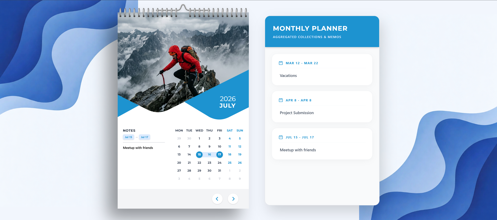

# Interactive Calendar Component

## Overview
This is a sophisticated, highly interactive React/Vite calendar component designed to flawlessly mimic a physical wall calendar aesthetic. Built completely with strict structural CSS mathematics, dynamic Javascript Date logic, and heavily integrated componentized rendering frames, it serves as a fully featured date manipulation tracker and personal notation tool.

## Key Features
* **Physical Aesthetic Scaling:** Integrated notebook-binder clipping, curved container boundaries, and native Drop-Shadow elevation lifting simulating heavy card stock floating off a curved backdrop.
* **Responsive Dual-Layout:** Includes a complex side-by-side 'Monthly Planner' Desktop module that cleanly collapses down into a completely fluid vertical scroll-view stack on mobile viewports safely without clipping data.
* **Persistent Markdown System:** Securely hooked into client-side `localStorage`, allowing functional creation and deletion of sticky memos that reliably persist across window refreshes.
* **Dynamic Time Navigation:** Continuous infinite scrolling through past and future months and years asynchronously rendering accurate leap cycles and previous-month boundary paddings.
* **Seamless Selections:** Dragging click selection mathematically computes start-end array bounds to intelligently render colored interactive connection ribbons identically across standard grids.

## Tech Stack
* **Framework**: React.js / Vite
* **Styling**: Tailwind CSS (Leveraging heavily arbitrary nested attributes, specific variable interpolations, fixed viewport layouts, CSS grid grids, and SVG dynamic masking inset overlays).
* **State Management**: Native React Hooks (`useState`, `useEffect`) hooked deeply within functional closures.

## Bootstrapping Locally
1. Clone this repository directly to your machine.
2. Run standard `npm install` inside the directory to generate node mapping.
3. Hook `npm run dev` to serve the component layout live!
